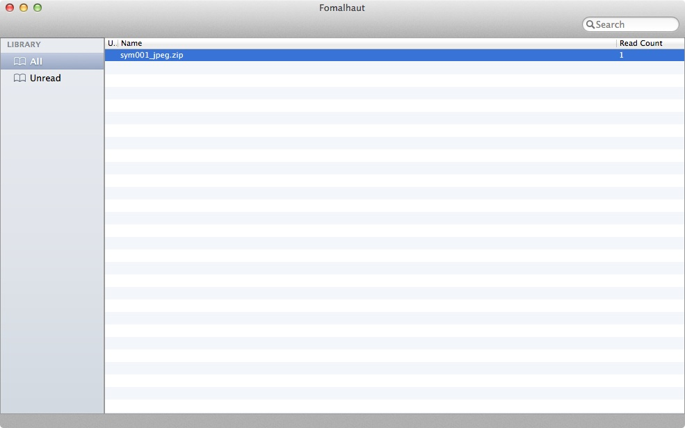

Fomalhaut
=========

Fomalhaut is Mac GUI application for management of books and providing html viewer.

# Feature
- list zip, cbz, pdf files.
- see above files with internal/external viewer.
- see above files with web browser.

# Screenshot
## Mac

## iPhone Safari

 聖☆おにいさん 第1話「ブッダの休日」 by 中村光 is licensed under a Creative Commons 表示 - 改変禁止 2.1 日本 License.

# System requirements
- Mac OS X 10.7 or later
- Intel Mac

# License
Fomalhaut is licensed by under the GNU GPL v3. See [Detail](https://github.com/mtgto/Fomalhaut/blob/master/LICENSE).
